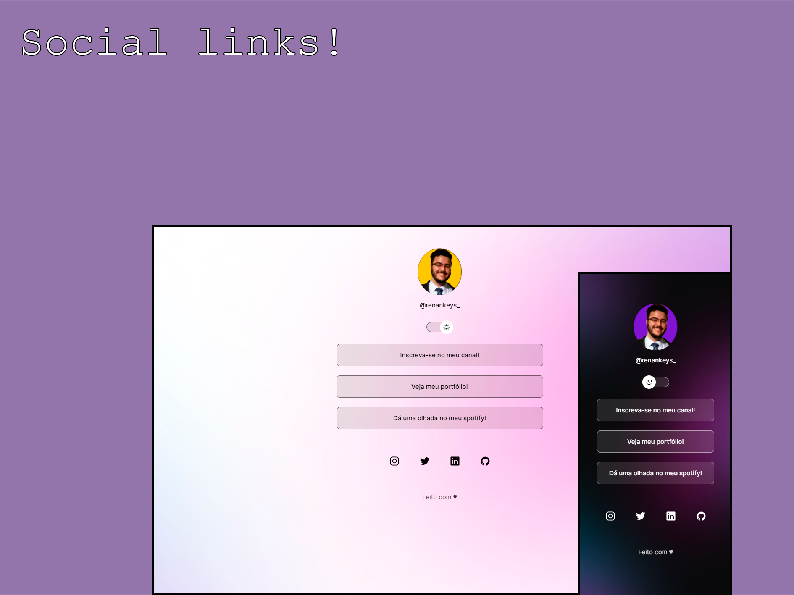

   
  

Programa desenvolvido na Rocketseat, criadora de conteúdo para ensino de tecnologias WEB.  

## 🌞 Tecnologias

- HTML e CSS
- JavaScript
- Git e Github
- Figma
   

## 🧵 Projeto

O projeto se baseia em um cartão de visitas, juntando todos os meus links sociais em apenas uma página!
 

## 🔖 Layout

O layout genérico do projeto está disponível [Nesse link](https://www.figma.com/community/file/1187422022288947321). É necessário ter conta no [Figma](https://figma.com) para acessá-lo.
